# package for processing the ecg signal 

#### prepare the data
1. prepare the data as dataframe or dictionary(array)  

Data should be like the following form:  
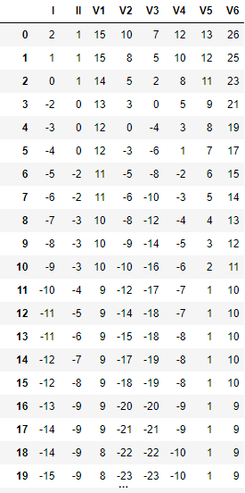

#### R peak
```python
# def R_peak(file,sampling_rate=500,lead='I',plot=False)
# lead: ['I', 'II, 'V1','V2','V3','V4','V5','V6']
# return: (np.array)Rpeaks
import ecg
rpeak = ecg.R_peak(df)
rpeak = ecg.R_peak(df,lead='II',plot=True)
```
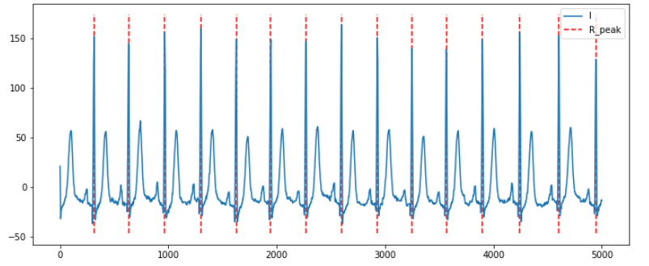

#### segment ecg signals 
```python
# def segment(file, method='base', lead='I', locate=False, sampling_rate=500, plot=True)
# method: base(using baseline drift to filter the signal) strengthed(using NeuralKit method) raw(using the raw signal)
# lead: accordign to the columns of data, normally, we have ['I','II','V1','V2','V3','V4','V5','V6']
# return: epochs_start, epochs_end, np.array(epochs)
import ecg
_,_,epochs = ecg.segment(df)
_,_,epochs = ecg.segment(df,method='raw')
```
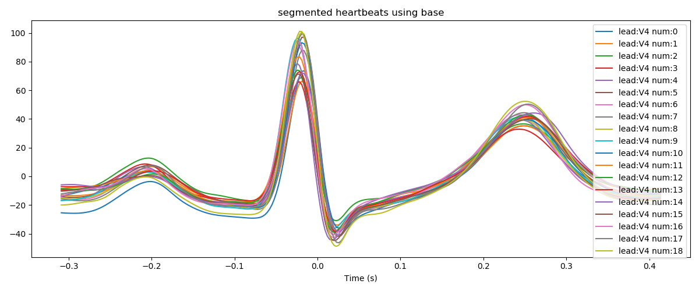
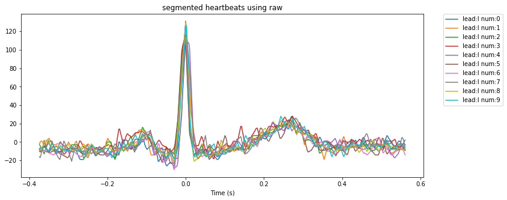

#### build up the average segment wave
```python
# def avg_segment(file,method='average',lead='all',sampling_rate=500,plot=True)
# lead: ['all', 'I', 'II, 'V1','V2','V3','V4','V5','V6']
# method: ['average', med']
# return: (np.array)average segment epoch
import ecg
r = ecg.avg_segment(df)
```
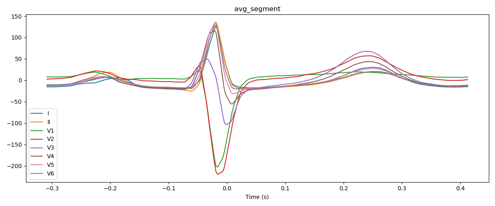
```python
import ecg
r = ecg.avg_segment(df,method='median',lead='V4')
```
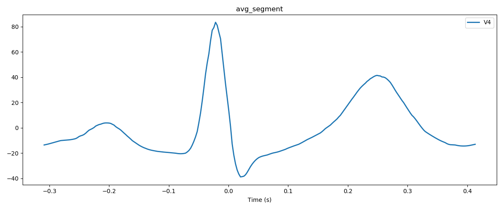

#### locate P QRS T waves 效果不佳，暂不用
thanks to *https://github.com/caledezma/WTdelineator*   
- **Cardiac Cycle**: A typical ECG heartbeat consists of a P wave, a QRS complex and a T wave.
      The P wave represents the wave of depolarization that spreads from the SA-node throughout the atria.
      The QRS complex reflects the rapid depolarization of the right and left ventricles. Since the
      ventricles are the largest part of the heart, in terms of mass, the QRS complex usually has a much
      larger amplitude than the P-wave. The T wave represents the ventricular repolarization of the
      ventricles.On rare occasions, a U wave can be seen following the T wave. The U wave is believed
      to be related to the last remnants of ventricular repolarization.  
- **心脏周期**：典型的ECG心跳包括P波，QRS复合波和T波。
       P波代表从SA节点扩展到整个心房的去极化波。
       QRS复合波反映了右心室和左心室的快速去极化。 自从
       心室是心脏的最大部分，就质量而言，QRS复合体通常具有很多
       振幅大于P波。 T波代表在极少数情况下，可以在T波之后看到U波。 相信U波与心室复极的最后残留有关。
```python
# def delineate(file,lead='I',start=0,end=-1,sampling_rate=500,plot_type='line')
# plot_type: ['line', 'node']
# return index of P(Pon,Pmax,Pmax2,Poff) QRS T
P,QRS,T = ecg.delineate(df,plot_type='line')
```
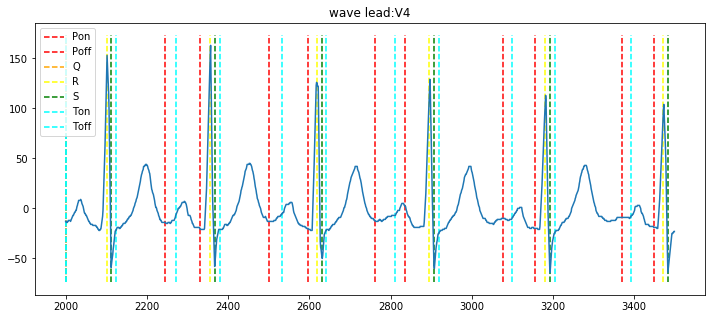
```python
import ecg
P,QRS,T = ecg.delineate(df,plot_type='node')
```
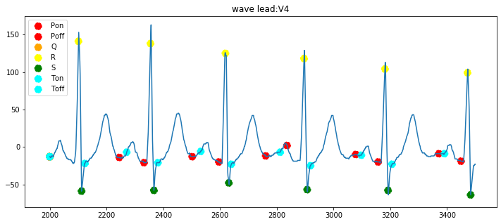

#### combine locating and segmenting
```python
# def segment(file, method='base', lead='I', locate=False, r=None,sampling_rate=500, plot=True)
# set locate = True
# r: 位置信息，也可以自行提供
import ecg
_,_,epochs = ecg.segment(df,lead='V4',locate = True)
```
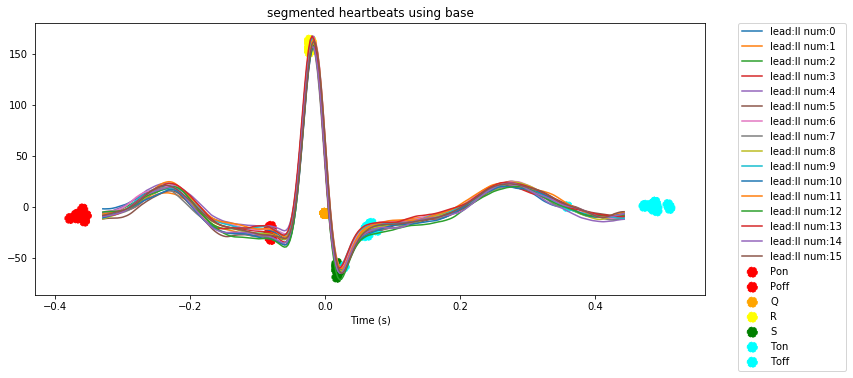


### Updated
#### locate P QRS T waves

According to *中华人民共和国医药行业标准 医用电气设备 第2-51部分：记录和分析型单道和多
道心电图机安全和基本性能专用要求* P49 rewrite the delineating method
```python
# ecg_delineate(file,sample_rate=500,plot=True,subplot=True)
# plot: True (automatically plot the signals and location boundaries)
# return: information of [Pon,Poff,QRSon,QRSoff,Toff]
import ecg
location,signals = ecg.ecg_delineate(df)
```
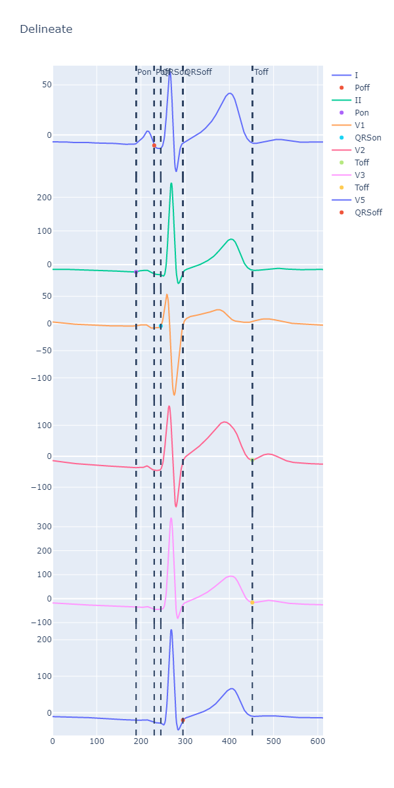
 ```python
# 取消subplot，将所有导联并在一起观察
location,signals = ecg.ecg_delineate(df,subplot=False)
```
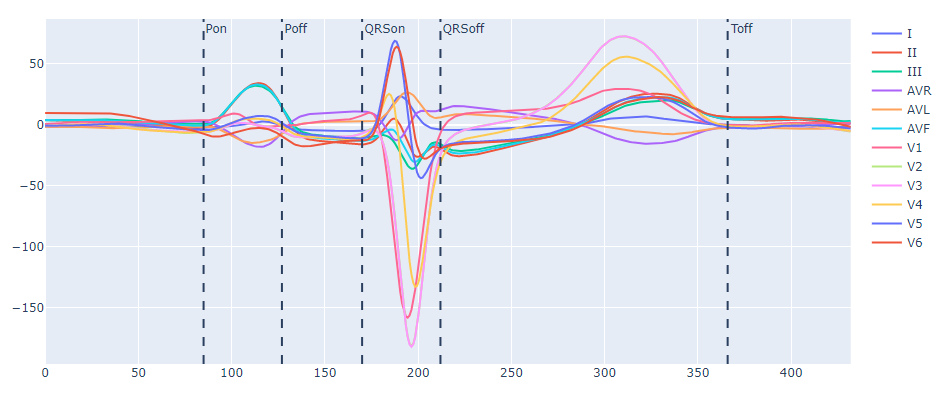

因为借助了plotly画图工具，可选择双击导联进行查看

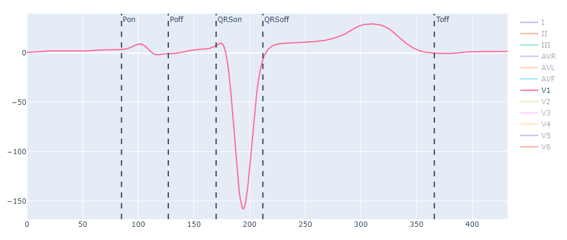
 ```python
# 针对每一个导联，将10s的ecg信号分割，对每一个单心拍作定位
location,signals = = ecg.ecg_delineate(df,lead='I',subplot=False)
```
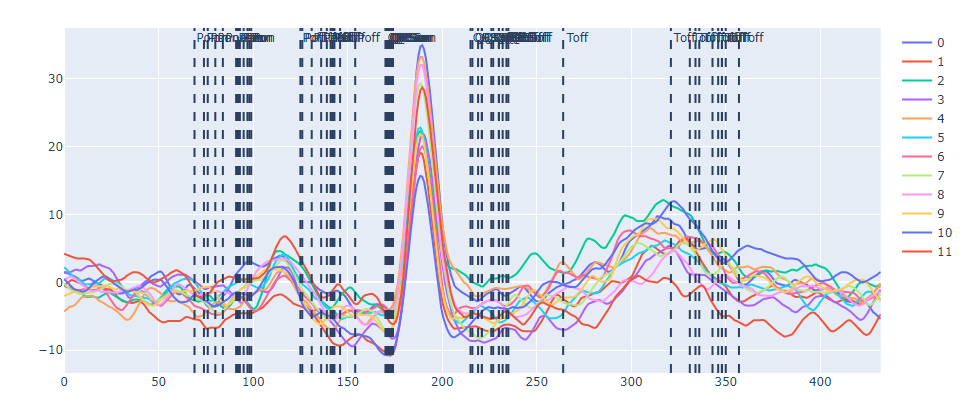

如下图所示，location中包含了定位的位置信息，key代表该导联在10s中的第几个心拍

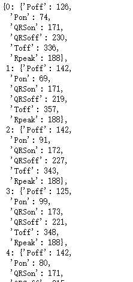